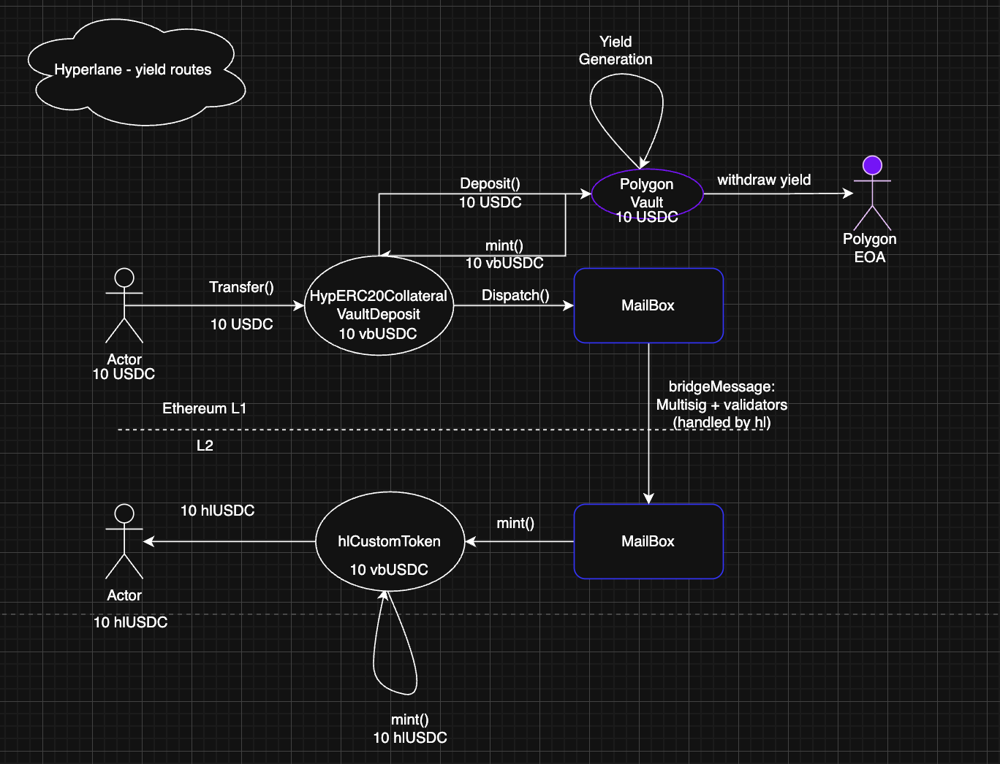

# Hyperlane

## Technology

- [Hyperlane Warp Routes](https://docs.hyperlane.xyz/docs/reference/applications/warp-routes)
- [Hyperlane Yield Routes](https://docs.hyperlane.xyz/docs/guides/warp-routes/evm/deploy-yield-routes)

## Compatibility

### Default HypERC20

- Supported VMs: EVM, Solana SVM and Cosmos VM
- Supported chains: [List](https://www.hyperlane.xyz/expansion)
- Custom Token: TBD
- Native Converter: TBD
- Bridged USDC Standard: TBD
- Wrapped Token: Available (HypERC20 Token)
- Manual Converter: TBD

## Process

1. Create yield route configuration using Hyperlane CLI with `hyperlane warp init`.
   - Select `collateralVault` type for Primary Chain (origin).
   - Select `synthetic` type for Secondary Chains (destinations).
   - Configure Interchain Security Module (ISM) - recommend using `messageIdMultisigIsm`
   - Set owner address for all chains (will control ProxyAdmin and contract upgrades).
2. Deploy yield route using Hyperlane CLI with `hyperlane warp deploy`.
   - Deploys `HypERC20CollateralVaultDeposit` on Primary Chain.
   - Deploys `HypERC20` (synthetic tokens) on all Secondary Chains.
   - Configures ISM and establishes cross-chain connections.
3. Verify deployment with `hyperlane warp read --symbol <SYMBOL>`.
4. Test bridge transaction with `hyperlane warp send --relay`.
5. (Optional) Upgrade `HypERC20` to custom vbToken implementation on Secondary Chains for enhanced features.

## Architecture

### Primary Chain (Origin)

- **Contract**: `HypERC20CollateralVaultDeposit`
- **Type**: `collateralVault`
- **Function**: Locks ERC-4626 vault shares and dispatches messages via Hyperlane Mailbox

### Secondary Chains (Destination)

- **Contract**: `HypERC20` (Synthetic)
- **Type**: `synthetic`
- **Function**: Mints/burns synthetic tokens based on cross-chain messages

### Message Flow


```
[User] → [HypERC20CollateralVaultDeposit] → [Vault Deposit] → [Mailbox] → [ISM] → [Relayer] ↓
[Recipient] ← [HypERC20 (mint)] ← [Mailbox] ← [ISM] ← [Destination Chain]
```

## Security Considerations

> [!WARNING]
> The Hyperlane Mailbox contract has minting rights for synthetic tokens on destination chains. A Mailbox compromise would affect all tokens using that Mailbox instance.

> [!TIP]
> Using `collateralVault` type limits exposure: only tokens deposited through the `HypERC20CollateralVaultDeposit` contract would be affected, not the entire vault balance.

## Configuration

### Interchain Security Modules (ISM)

Recommended ISM types for production:

- **messageIdMultisigIsm**: Multisig validators verify message IDs
- **merkleRootMultisigIsm**: Multisig validators verify Merkle roots
- **staticAggregationIsm**: Combines multiple ISM types (e.g., trusted relayer + multisig)

Example configuration:

```yaml
interchainSecurityModule:
  type: messageIdMultisigIsm
  validators:
    - "0x..." # Validator address 1
    - "0x..." # Validator address 2
  threshold: 2 # Number of signatures required
```

### Ownership

The `owner` address specified during deployment controls:

- ProxyAdmin (can upgrade contracts)
- Contract configuration (ISM updates, etc.)

## Upgrade Path

The recommended approach is to use the standard HypERC20 contracts deployed by Hyperlane.

**Pros**:
- Battle-tested Hyperlane contracts
- No additional audits required
- Simpler maintenance

**Cons**:
- Less flexibility for custom features
- Standard Hyperlane UX/functionality only

## Reference

- Hyperlane Docs: [Warp Routes](https://docs.hyperlane.xyz/docs/reference/applications/warp-routes)
- Hyperlane Docs: [Yield Routes Guide](https://docs.hyperlane.xyz/docs/guides/warp-routes/evm/deploy-yield-routes)
- Hyperlane Docs: [ISM Configuration](https://docs.hyperlane.xyz/docs/reference/ISM/specify-your-ISM)
- GitHub: [hyperlane-xyz/hyperlane-monorepo](https://github.com/hyperlane-xyz/hyperlane-monorepo)
- Explorer: [Hyperlane Message Explorer](https://explorer.hyperlane.xyz/)
- Integration Guide: [`HYPERLANE_INTEGRATION.md`](../../../../HYPERLANE_INTEGRATION.md)

## Useful Commands

```bash
# Initialize yield route configuration
hyperlane warp init -o yield-route-config.yaml

# Deploy yield route
hyperlane warp deploy --warp yield-route-config.yaml

# Read deployed configuration
hyperlane warp read --symbol <SYMBOL>

# Send tokens with relay
hyperlane warp send --relay \
  --warp <config-path> \
  --origin <chain> \
  --destination <chain>

# Update ISM configuration
hyperlane warp apply \
  --warp <deploy-config> \
  --config <warp-config>

# Check message status
# Visit: https://explorer.hyperlane.xyz/message/<message-id>
```

## Testnet Deployment Example

**Route**: Sepolia → Optimism Sepolia & Polygon Amoy

| Chain | Contract Type | Address |
|-------|--------------|---------|
| Sepolia | HypERC20CollateralVaultDeposit | `0x5C0edadd0b674E932dF98d1Bb0f4aec41494A0EA` |
| Optimism Sepolia | HypERC20 (Synthetic) | `0xD497c6AF38fD6AcC916759B7C956210De27DE61B` |
| Polygon Amoy | HypERC20 (Synthetic) | `0xf7CC62aD0D6A439469E4Ce7CFBA510A1A30b1fA0` |

**Vault**: `0xb62Ba0719527701309339a175dDe3CBF1770dd38` (Sepolia)
